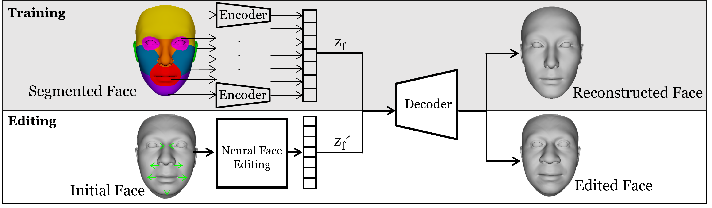
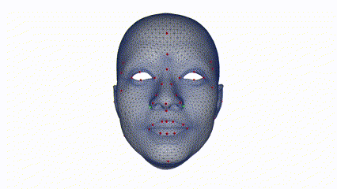

<div align="center">

# Face Editing Using Part-Based Optimization of the Latent Space

</div>

<div align="center">

[](http://dx.doi.org/10.1111/cgf.14760)

</div>

<div align="center">  

[](http://dx.doi.org/10.1111/cgf.14760)

</div>

## Citation
This is the official PyTorch implementation of _**Face Editing Using Part-Based Optimization of the Latent Space**_. Please cite [this paper](http://dx.doi.org/10.1111/cgf.14760) if you use this code in your own work. Please also let [us](mailto:eric.paquette@etsmtl.ca) know.
```
@article{https://doi.org/10.1111/cgf.14760,
author = {Aliari, Mohammad Amin and Beauchamp, Andre and Popa, Tiberiu and Paquette, Eric},
title = {Face Editing Using Part-Based Optimization of the Latent Space},
journal = {Computer Graphics Forum},
volume = {42},
number = {2},
pages = {269-279},
keywords = {CCS Concepts, • Computing methodologies → Mesh models, Neural networks},
doi = {https://doi.org/10.1111/cgf.14760},
url = {https://onlinelibrary.wiley.com/doi/abs/10.1111/cgf.14760},
eprint = {https://onlinelibrary.wiley.com/doi/pdf/10.1111/cgf.14760},
year = {2023}
}
```
## How to train and use the model:
1. Install `requirements.txt`.
	- For installing `psbody_mesh` on Windows, follow this [link](https://github.com/johnbanq/mesh/tree/fix/MSVC_compilation). We use version `0.3`.
2. Place the meshes in a directory with names following this format: `face (1).obj` to `face (i).obj`.

3. Open `src/face_exctractor.py`:
	- Set the heads_path to the dir mentioned in (2) in `src/face_exctractor.py`.
	- Run `src/face_exctractor.py`.

4. Open `src/part_exctractor.py`:
	- Set the heads_path to the dir mentioned in (2) in `src/part_exctractor.py`.
	- Run `src/part_exctractor.py`.

5. Open and follow the steps in `src/train.py` or `src/train.ipynbpy` to train the model.

6. Open `src/face_editor.py`:
	- Set `model_path` to the newly trained model.
	
7. The face editor can be launched now:
	- `python src/face_editor.py`



## Dataset
The model can be trained with the FaceWarehouse dataset. It can be acquired by following the steps described [here](http://kunzhou.net/zjugaps/facewarehouse).

## Project structure:
- **Model name:** `NEURAL_FACE`
	- Path: `src/coma/models/neural_face.py`

- `src/face_editor.py`:
	- It is an environment to edit and test the faces.
	- It supports texturing by passing `viewer.add_mesh` the texture image path.
		- `toggle_texture()` can be called to show the textures.

- **Customizable files:** The following files in the `/data` folder are hand generated and customizable:
	1. `landmarks.json`: Face landmarks. These are the editing points.

	2. `measures.json`: These are the defined measurements. 
		- We have different measures like nose width, lips height, etc.
		- New ones can easily be defined. They can also bed used with any newly defined landmarks.
		- We also have a number of equations, and new ones can be defined in `util_control.py`.

	3. `face.csv` and `parts_info` files: 
		- These are our defined face areas and segmentations. 
		- Most DCC tool can be used to select other sets of vertices for each segment.
		- Beware that some DCC tools start the vertex index from `1` and others from `0`. This might introduce some bugs in runtime. `Controller.do_minus_one` can be set to fix the issue.

## References
- [Ranjan, A., Bolkart, T., Sanyal, S., & Black, M. J. (2018). Generating 3D faces using convolutional mesh autoencoders. _Proceedings of the European Conference on Computer Vision (ECCV)_, 704–720.](https://github.com/sw-gong/coma)
- [C. Cao, Y. Weng, S. Zhou, Y. Tong and K. Zhou, "FaceWarehouse: A 3D Facial Expression Database for Visual Computing," in _IEEE Transactions on Visualization and Computer Graphics_, vol. 20, no. 3, pp. 413-425, March 2014, doi: 10.1109/TVCG.2013.249.](http://kunzhou.net/zjugaps/facewarehouse)

© [2023] Ubisoft Entertainment. All Rights Reserved
